# 🎤 Dabroken

<div align="center">


[](https://tauri.app/)
[](https://reactjs.org/)
[](https://www.typescriptlang.org/)
[](https://www.rust-lang.org/)

**Una aplicación de clonación de voz que funciona igual que [Dababel](https://www.dababel.com/)** (literalmente)

</div>

---

## 🎯 Acerca del Proyecto

### 😺 **Dabroken** hace lo mismo pero sin traduccion (aun):

**Dabroken** te permite clonar tu voz de la misma manera que Dababel y no es broma

Surgió como un proyecto **en broma** 😂, al investigar el funcionamiento de Dababel, vi qué lo que ellos realmente hacen: es guardar tu voz en su almacenamiento que **por cierto está desprotegido** 🤡, luego hacen un puente a Azure AI, y de allí pasa a ElevenLabs ¡Y LISTO! **¡ESO ES TODO!**

### 💸 La estafa de $7 USD por semana

Es **gracioso** que lo hayan hecho en Electron, **gastando rendimiento** como si no hubiera un mañana. 

### 💡 ¿Qué hace realmente Dababel?

```mermaid
graph LR
    A[Usuario paga $7/semana 💸] --> B[Grabas tu voz 🎤]
    B --> C[S3 desprotegido 🔓]
    C --> D[Azure AI Services ☁️]
    D --> E[ElevenLabs API 🤖]
    E --> F[Voice ID generado ✨]
    F --> G[TTS con tu voz 🗣️]
    G --> H[Estafa! 💰]
```




Y para la traducción, **lo mismo**, solo imaginen que usan Azure Translation o algo tan sencillo como Google Traductor y eso lo pasan a mas servicios.

Aunque tenga otras funciones como enviarlo a un microfono, usan VB-Cable, un driver gratuito, Ni si quiera usaron uno que tengan que pagar!
### 🤯 La realidad que duele

Es **increíble** que la gente se sorprenda con cosas que son **fáciles de hacer**, y aún más increíble que viniendo de un streamer grande *(ojo no voy nada en contra de él)*, con los que voy en contra son contra los **desarrolladores de la aplicación que dejan al descubierto todo, sin protección alguna**. 

**¡Tan miserables que ni siquiera tuve que iniciar sesión!** 🤦‍♂️ **Literalmente puedes obtener todo lo necesario para recrear una app gratis sin crear una cuenta.** ¿En serio cobran por esto?

**Mínimo hubiesen contratado a MiduDev amigos, ese sí sabe jaja** 😎


## ✨ Comentarios

> *No te cobraré $7 por semana por algo que ni siquiera requiere cuenta (si es que no se dan cuenta)* 😏


---

## 🚀 Instalación

### Prerrequisitos

- **Node.js** (v18 o superior)
- **pnpm**
- **Rust**

### Pasos rápidos

```bash
git clone https://github.com/Revenzmind/dabroken.git
cd dabroken
pnpm install
```

---

## ⚡ Desarrollo

```bash
# Iniciar el servidor de desarrollo
pnpm dev

# Construir para producción
pnpm build

# Construir aplicación nativa
pnpm tauri build
```

---

## 🛠️ Tecnologías

- **Frontend**: React 18, TypeScript, Vite
- **Backend**: Rust, Tauri 2.0
- **Herramientas**: pnpm, ESLint, Prettier

---

## 🤝 Contribuir

1. Fork el proyecto
2. Crea tu rama de características (`git checkout -b feature/nueva-funcionalidad`)
3. Commit tus cambios (`git commit -m 'Agrega nueva funcionalidad'`)
4. Push a la rama (`git push origin feature/nueva-funcionalidad`)
5. Abre un Pull Request

---

<div align="center">

**¡Construido con ❤️ para demostrar como funciona Dababel y que tan vulnerable es!**

### 👏 Agradecimientos

Un agradecimiento especial a GitHub Copilot por ayudar a organizar este proyecto y estructurar esta documentación de manera clara y efectiva.

</div>
